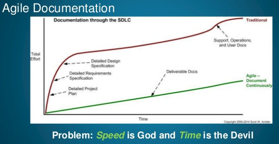

= Continuous Documentation - Une pratique saine
Quentin Vandekerckhove <qvandekerckhove@salto-consulting.com>
v1.0, 2016-10-24

Souvent perçue comme une corvée, la documentation est dans la plupart des cas délaissée. Au mieux elle est reportée en fin de projet, au pire elle finit à la trappe. Les raisons de cette perdition sont souvent le manque de temps ou de budget. En fin de course, il est difficile de négocier une rallonge pour rédiger de la documentation.

Pourtant, l’utilité de celle-ci fait souvent l’unanimité. Elle est un facteur clef pour le link:https://fr.wikipedia.org/wiki/Maintien_en_condition_op%C3%A9rationnelle[maintien en condition opérationnelle (MCO)], sur l’intégration de l’application au sein du SI ou encore facilite la prise en main du projet par une nouvelle recrue.

Par ailleurs, celle-ci fait partie des link:http://agilemodeling.com/[bonnes pratiques de la méthodologie Agile]. En effet, les préceptes de la méthodologie agile recommande d’arriver à un état livrable de votre application à la fin de chaque sprint, alors pourquoi ne pas l’y inclure?

== Les bénéfices

=== Une documentation disponible à chaque fin de spring/jalon

*La rédaction au-fur-et-à-mesure vous garantie d’avoir une documentation synchronisée avec l’évolution de votre application.* Vous éviterez ainsi l’écueil d’une application sans documentation en fin de projet, et de ne plus disposer de moyens – temps et/ou budget – pour la réaliser. De plus à la fin de chaque sprint, votre application est dans un état livrable. Elle contiendra, à minima, d’un guide de l’utilisateur, d’une notice d’installation ou d’un manuel d’exploitation. Bref, votre application prend l’air d’un produit fini et délivrable à un client.

=== Une documentation précise

D’autre part, vous vous rappellerez plus aisément des points les plus importants *en rédigeant leurs documentations dans un délai assez court après leurs réalisations.* En conséquence, votre documentation en sera d’autant plus précise.

=== Une documentation pour chaque version de l’application

Enfin, cette synchronisation du code et de la documentation les met dans un cycle de vie identique. *Code source et documentation évoluent ensemble*, et pourquoi pas *versionnée ensemble*. Vous disposez, alors, d’*une documentation adéquate en fonction de chacune des versions de votre application*. Ainsi, par exemple, la dernière version de la documentation décrit les nouveaux paramètres d’une fonctionnalité, la précédente ceux devenus obsolètes mais encore valable pour la version antérieure (tout est bien dans le meilleur des mondes).

== Les écueils

=== Documenter au moment opportun

Les exigences sont susceptibles d’évoluer tout au long du projet, vous obligeant à retravailler la documentation pour refléter ces changements. Aussi, il est préférable de *ne pas documenter trop vite ou trop souvent*. Mieux vaut attendre un état stable du produit. Vous éviterez ainsi de perdre du temps et de l’argent à retravailler la documentation.

=== Une documentation concise et adaptée aux besoins du produit

Il n’est pas nécessaire de tout documenter. La documentation n’a pas vocation à remplacer un cahier des charges ou des spécifications techniques. Bien souvent il sera préférable d’y trouver le manuel d’utilisation (accompagné d’exemples), un guide d’intégration, la description des API, etc. De plus, mieux vaut ne pas trop en faire. La rédaction doit rester rapide et concise.

Dans un prochain article, je vous présenterai un exemple de mise en oeuvre d’une « Continuous Documentation ».

Publication initiale: http://www.salto-consulting.com/continuous-documentation/
